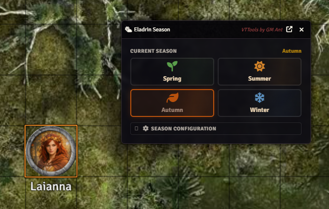
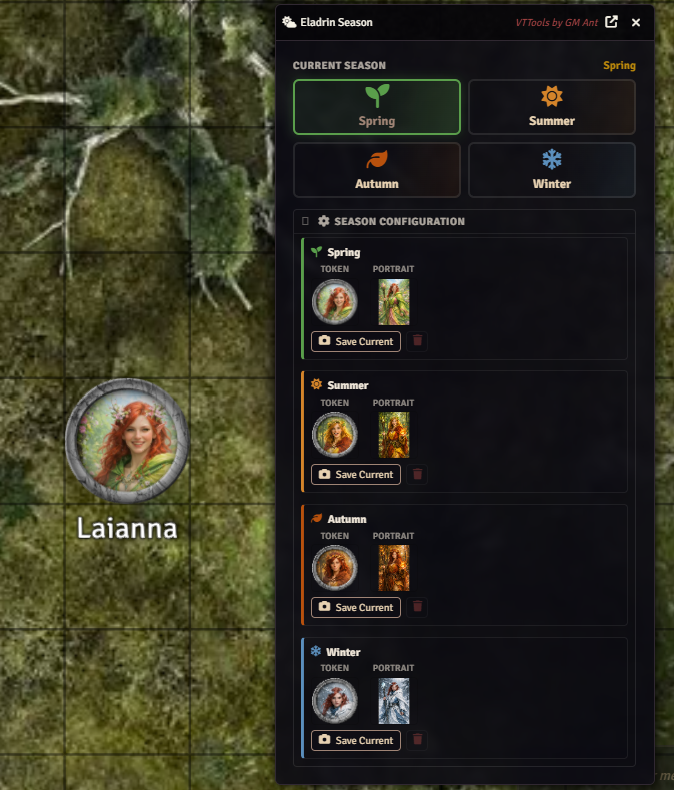
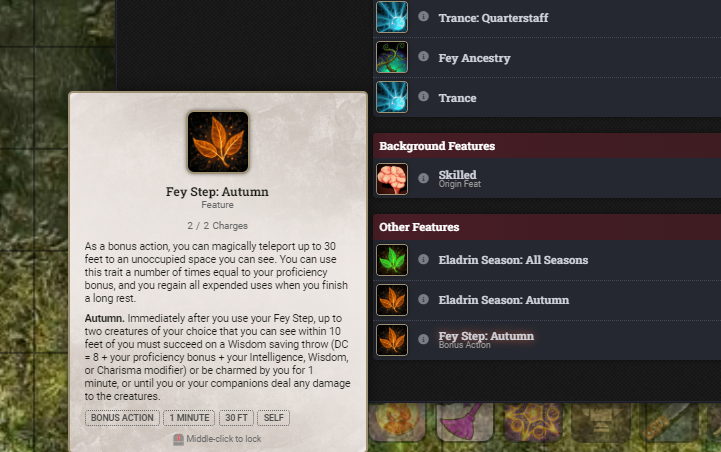

# GMAnt's Eladrin


One-click Eladrin season management for D&D 5e in Foundry VTT. Change your Eladrin's season — swap token art, portrait, and Fey Step racial feature — all in a single click. Includes interactive Fey Step teleport with seasonal particle effects.



## Features

- **One-click season change** — Spring, Summer, Autumn, Winter from a clean 2x2 dialog
- **Token & portrait swap** — Save per-season art with a "Save Current Look" workflow, auto-applied on season change
- **Fey Step item swap** — Automatically replaces your Fey Step racial feature with the correct seasonal variant from the module compendium (preserves spent uses)
- **Interactive Fey Step teleport** — Particle ring shows 30ft range, ghost token follows your cursor (green = in range, red = out), snap-to-grid placement
- **Seasonal particle effects** — Flowers (Spring), sun motes (Summer), falling leaves (Autumn), snowflakes (Winter) during teleport
- **Sequencer + JB2A support** — Animated departure/arrival effects when available, simple fade fallback otherwise
- **Automatic seasonal bonuses** — Triggers the correct damage roll or saving throw after teleporting (Autumn charm, Winter frighten, Spring ally teleport, Summer fire damage)
- **MIDI QOL integration** — Optional setting renames your existing Fey Step instead of replacing it, preserving all automation and effects
- **Eladrin opt-in toggle** — Header button on actor sheets lets any character use the feature (for homebrew or reflavored races)
- **Scene control button** — Quick access from the token controls sidebar
- **Compendium macro** — "Change Season" macro for hotbar access
- **Public API** — `game.modules.get("gmants-eladrin").api.open()` for macro integration

## Installation

### Manifest URL (recommended)

1. In Foundry VTT, go to **Add-on Modules** > **Install Module**
2. Paste the manifest URL:
   ```
   https://github.com/AntTheGM/gmants-eladrin/releases/latest/download/module.json
   ```
3. Click **Install**

### Manual Download

1. Download `module.zip` from the [latest release](https://github.com/AntTheGM/gmants-eladrin/releases/latest)
2. Extract to your `Data/modules/gmants-eladrin/` directory
3. Restart Foundry

## Usage

1. **Select your Eladrin token** on the canvas
2. **Open the dialog** via:
   - The sun/cloud icon in the token controls sidebar, or
   - The "Change Season" macro from the module compendium, or
   - `game.modules.get("gmants-eladrin").api.open()` in a macro
3. **Set up season images** (first time):
   - Set your character's token and portrait to the Spring look
   - Expand "Season Configuration" in the dialog
   - Click "Save Current as Spring"
   - Repeat for each season
4. **Change season** — click any season button. Token, portrait, and Fey Step swap instantly



5. **Fey Step teleport** — use the Fey Step item normally. The module intercepts the use and opens an interactive teleport targeting mode with range ring and particle effects



### Non-Eladrin Characters

For homebrew or reflavored characters, click the sun/cloud icon in the actor sheet header to toggle Eladrin features on.

## Configuration

| Setting | Default | Description |
|---------|---------|-------------|
| **Show Eladrin Season Button** | On | Display the scene control button. Disable to hide it (macro and API still work) |
| **Enhanced Automation (Fey Step)** | Off | When enabled, renames your existing Fey Step item on season change instead of replacing it, preserving MIDI QOL automation and effects |

## Compatibility

- **Foundry VTT:** v13+
- **D&D 5e System:** v5.0.0+
- **Optional modules:**
  - [MIDI QOL](https://gitlab.com/tposney/midi-qol) — automated Fey Step saves, damage, and condition application
  - [Sequencer](https://github.com/fantasycalendar/FoundryVTT-Sequencer) — teleport departure/arrival animations
  - [JB2A](https://jb2a.com/) — animated assets for Fey Step effects (free or patreon)

## Contributing

See [CONTRIBUTING.md](CONTRIBUTING.md) for guidelines. Bug fixes welcome — new features, please open an issue first.

## Support

Found a bug or have a question? [Open an issue](https://github.com/AntTheGM/gmants-eladrin/issues).

## License

[MIT](LICENSE)

## Credits

**VTTools by GM Ant** — Quality-of-life modules for Foundry VTT.
